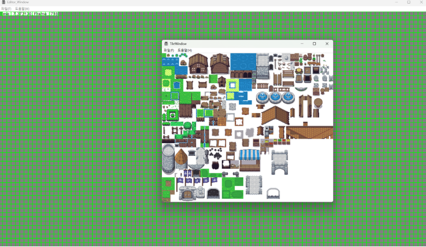
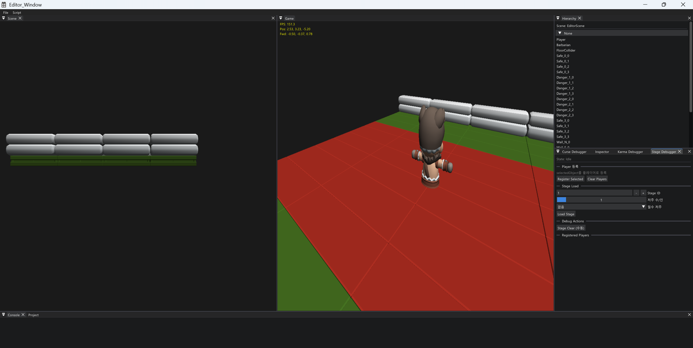
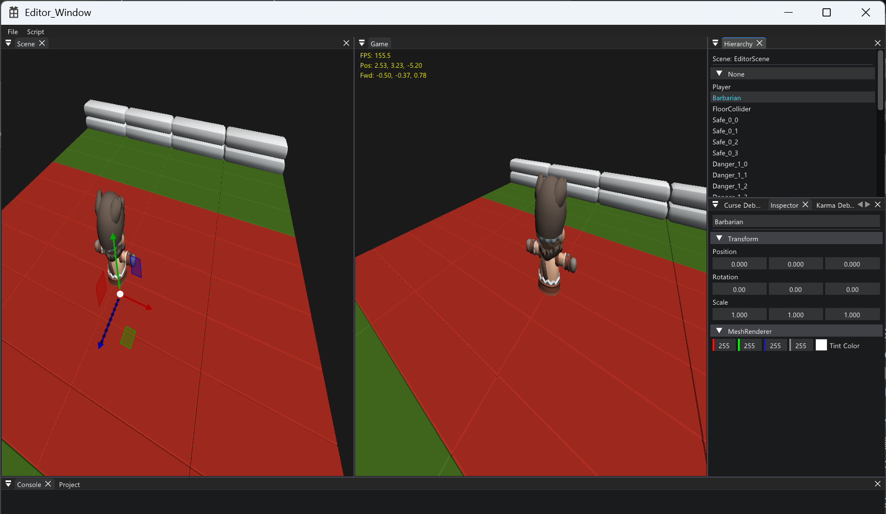
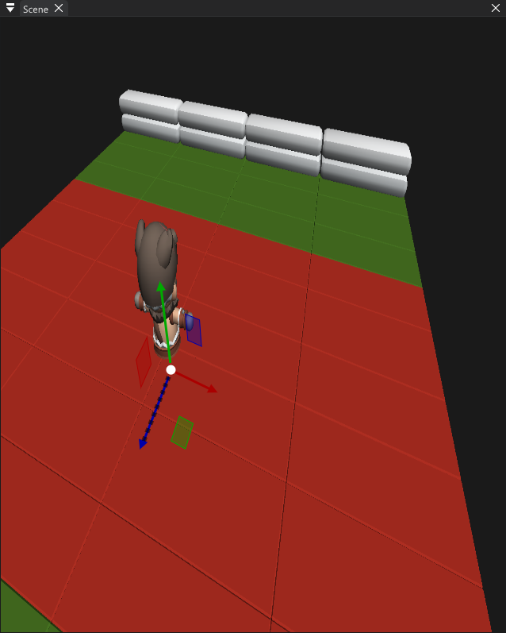
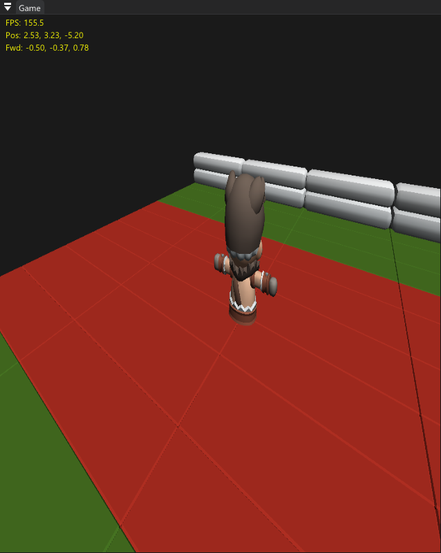

# NuNuEngine

> C++ / DirectX 12 기반 2D·3D 게임 엔진과 ImGui 에디터

---

## 프로젝트 개요

이 저장소는 인프런 **얌얌코딩** 강의 두 편을 따라 만든 **클론코딩** 결과물입니다.

1. [C++을 이용한 자체 엔진 제작 (유니티 엔진 클론코딩)](https://www.inflearn.com/courses/lecture?courseId=333102&tab=curriculum&type=LECTURE&unitId=212840) — Win32 / GDI 기반 2D 엔진, 이후 DirectX 11 전환
2. [게임 엔진 만들기 - Directx12 로 전환하기 (PART2)](https://www.inflearn.com/courses/lecture?courseId=337605&tab=curriculum&type=LECTURE&unitId=312785) — ImGui 에디터, 씬뷰 / 게임뷰 구현, DirectX 12 전환

엔진의 구조와 설계는 강의를 그대로 따라간 것이며, 설계에 대한 공은 전적으로 강의에 있습니다.
두 강의를 마친 뒤에는 이 엔진으로 게임을 하나 기획해, 거기에 필요한 기능을 붙여 보며 확인했습니다.

### 진행 경과

| 단계 | 기간 | 커밋 | 내용 |
|---|---|---|---|
| 2D 엔진 (1) | 2026.02.21 - 03.19 | 35 | Win32 / GDI 2D 렌더링, GameObject-Component 구조, 씬·레이어, 리소스, 충돌, 애니메이션, 타일맵, FMOD |
| DirectX 전환과 에디터 (1), (2) | 2026.03.19 - 03.29 | 46 | DirectX 11 전환, 셰이더·버퍼·머티리얼 클래스 설계, ImGui + ImGuizmo 에디터, 도킹·인스펙터·씬뷰/게임뷰, 이벤트 시스템, DirectX 12 전환, Assimp FBX 로더 |
| 기획한 게임 붙여 보기 | 2026.03.30 - 04.01 | 18 | 3D 캐릭터 컨트롤러, AABB 충돌, 저주·카르마 시스템, 스테이지 관리, JSON 씬 직렬화, 에디터 보완 |

- 인원: 1인
- 언어 / 표준: C++20

---

## 스크린샷

<table>
  <tr>
    <td colspan="3"></td>
    <td colspan="3"></td>
  </tr>
  <tr>
    <td colspan="2"></td>
    <td colspan="2"></td>
    <td colspan="2"></td>
  </tr>
</table>

---

## 구현 내용

### 프레임 라이프사이클

```
Application::Run()
  ├─ Update()       Input -> Time -> Collision -> Stage -> UI -> Scene
  ├─ LateUpdate()   Collision -> UI -> Scene
  ├─ Render()       커맨드 할당자/리스트 리셋 -> 루트 시그니처 -> 뷰포트
  │                 -> 리소스 배리어 -> 프레임 버퍼 바인딩
  │                 -> Scene -> Collision -> UI 렌더 -> Present
  └─ EndOfFrame()   쌓아 둔 생성·파괴 이벤트 처리
```

`Instantiate()`는 객체를 바로 만들어 반환하지만, 씬에 등록하는 일은 미룹니다.
`Destroy()`도 상태만 즉시 `Destroyed`로 바꾸고, 목록에서 빼고 메모리를 해제하는 일은 미룹니다.
둘 다 `SceneManager`의 이벤트 큐에 이벤트를 넣어 두고, 프레임 끝의 `EndOfFrame()`에서
큐를 비우며 한꺼번에 처리합니다. 순회 도중에 오브젝트 목록을 건드리면 이터레이터가 깨지기 때문입니다.
`GameObject`는 `Active` / `Paused` / `Destroyed` 세 상태를 오갑니다.

### 렌더링

| 항목 | 내용 |
|---|---|
| 그래픽 API | DirectX 11로 먼저 만든 뒤 DirectX 12로 전환. 두 디바이스 구현이 모두 남아 있으며 현재 동작 경로는 DX12 |
| 파이프라인 | PSO / 루트 시그니처 구성, 커맨드 리스트 기반 렌더 루프, 프레임 동기화(펜스), `d3dx12` 헬퍼 사용 |
| 버퍼 | Vertex / Index / Constant Buffer 래핑 (`CreateCommittedResource` -> `Map` -> 뷰 구성) |
| 셰이더 | HLSL - `Mesh3D`(WVP + diffuse), `SpriteDefault`, `Wireframe`, `Triangle` |
| 텍스처 | DirectXTex로 DDS / WIC 로딩, 알베도 텍스처 샘플링, 샘플러 상태 4종 |
| 상태 | 래스터라이저 / 블렌드 / 깊이-스텐실 상태 분리 |
| 렌더 타겟 | 씬 뷰와 게임 뷰를 각각 render-to-texture로 분리해 ImGui 패널에 출력 |

### 오브젝트와 씬

`GameObject`와 `Component`는 모두 `Labelled`를 상속한 형제이고,
`GameObject`가 `vector<Component*>`로 컴포넌트를 소유하는 조립형 구조입니다.

컴포넌트는 21종이며 모두 `Component`를 상속합니다.
컴포넌트 배열은 `eComponentType`의 개수(15)만큼 자리를 미리 잡아 두고
열거형 값을 그대로 인덱스로 씁니다. 하위 클래스가 상위의 자리를 함께 쓰기 때문에
클래스 수와 자리 수가 다릅니다.

| 분류 | 컴포넌트 |
|---|---|
| 기본 | `Transform` `Script` |
| 카메라 | `Camera` `EditorCamera` `SceneCamera` |
| 렌더 | `BaseRenderer` `SpriteRenderer` `TilemapRenderer` `MeshRenderer` |
| 2D 충돌 | `Collider` `BoxCollider2D` `CircleCollider2D` |
| 3D 충돌·이동 | `Collider3D` `CharacterController` `Rigidbody` |
| 애니메이션 | `Animator` |
| 오디오 | `AudioSource` `AudioListener` |
| 기획한 게임용 | `Health` `CurseComponent` `KarmaComponent` |

`Scene` / `SceneManager` / `Layer` / `DontDestroyOnLoad`로 씬을 관리하고,
`SceneSerializer`(nlohmann/json)로 씬 구성을 파일에 저장하고 복원합니다.

### 리소스

`Resources` 캐시 위에 `Texture` `Mesh` `Mesh3D` `Material` `Shader` `AudioClip` `Animation`을 두고,
같은 경로를 다시 요청하면 캐시에서 돌려주는 구조입니다.
3D 모델은 Assimp로 FBX를 파싱해 GPU 버퍼로 올립니다.

### 충돌과 입력

- `CollisionManager` - `std::bitset` 기반 레이어 충돌 매트릭스, 콜라이더 쌍의 `Enter` / `Stay` / `Exit` 상태 추적
- AABB 3D 충돌과 `Resolve3D` - `CharacterController`의 축별 침투 해소로 바닥과 벽을 구분해 처리
- `Input` / `Time` 헬퍼
- 이벤트 시스템 - `EventQueue`와 Key / Mouse / Application / GameObject 이벤트

### 에디터

Dear ImGui와 ImGuizmo로 만든 도킹 기반 에디터입니다. `EditorWindow`를 상속해 패널을 추가합니다.

| 패널 | 기능 |
|---|---|
| Hierarchy | 씬 오브젝트 트리, 생성·삭제·이름 변경 |
| Inspector | 선택 오브젝트의 컴포넌트 표시 및 값 편집 |
| Scene | render-to-texture 씬 뷰, 우클릭 + WASD/Q/E 네비게이션, ImGuizmo 트랜스폼 조작 |
| Game | 게임 카메라 출력. 포커스 게이트로 에디터 입력과 게임 입력 분리 |
| Project | 리소스 브라우저 |
| Console | 로그 출력 |
| Curse / Stage / Karma Debugger | 기획한 게임용 디버그 창 |

---

## 빌드

요구 사항

- Windows 10 이상 (x64)
- Visual Studio 2022 (MSVC v145, C++20)
- Windows SDK 10
- DirectX 12 지원 GPU

절차

```
1. NuNu_Engine.slnx 를 Visual Studio 2022로 엽니다.
2. 구성: x64 / Debug 또는 Release
3. 시작 프로젝트를 Editor_Window 로 지정합니다.
4. 빌드 후 실행 (F5)
```

외부 라이브러리(Assimp, FMOD, DirectXTex, Dear ImGui, nlohmann/json)는 `External/`과 `Vendor/`에 포함되어 있어 별도 설치가 필요 없습니다.
실행 시 `External/Library/Fmod/{Debug|Release}/`의 DLL이 출력 폴더에 있어야 합니다.

---

## 구조

```
NuNuEngine/
├─ NuNuEngine_CORE/          엔진 코어 (정적 라이브러리)
│  ├─ Graphics/              DX11/DX12 디바이스, GPU 버퍼, 렌더 타겟
│  ├─ High Level Interface/  Application, Window, Renderer
│  ├─ Component/             컴포넌트 21종
│  ├─ Resource/              Texture, Mesh, Mesh3D, Material, Shader, AudioClip
│  ├─ Scene/                 Scene, SceneManager, SceneSerializer, DontDestroyOnLoad
│  ├─ Collision/             CollisionManager (레이어 매트릭스 / AABB 3D)
│  ├─ Event/                 이벤트 큐 및 이벤트 타입
│  ├─ UI/                    UIManager, Button, HUD
│  ├─ Fmod/                  FMOD 래퍼
│  └─ Common/                수학(SimpleMath 기반), 열거형, 공통 include
│
├─ Editor_Window/            ImGui 기반 에디터 (실행 프로젝트)
├─ NuNuEngine_Window/        엔진 위에 올린 샘플 씬·콘텐츠·스크립트
├─ Shader_Source/            HLSL 셰이더
├─ Contents/                 3D 모델·텍스처 에셋 (KayKit)
├─ External/ , Vendor/       외부 라이브러리
└─ docs/                     기획·설계 문서, 스크린샷
```

파일명에는 `N` 접두사를 쓰지만(`NTransform.h`) 클래스명에는 붙이지 않습니다(`NuNu::Transform`).

---

## 서드파티

이 저장소는 외부 오픈소스 라이브러리와 에셋을 포함합니다.
저작권 및 라이선스 고지는 [`THIRD_PARTY_NOTICES.md`](THIRD_PARTY_NOTICES.md)를 참고하세요.

---

## 라이선스 및 이용 안내

- 앞서 밝힌 대로 이 저장소의 엔진 구조는 인프런 얌얌코딩 강의를 따라 구현한 클론코딩이며, 학습 목적의 개인 저장소입니다.
- 강의 내용에 해당하는 설계와 코드의 권리는 원 강의에 있습니다. 상업적 이용이나 재배포를 목적으로 하지 않습니다.
- 포함된 서드파티 구성 요소는 각자의 라이선스를 따릅니다.
